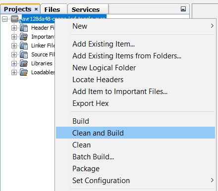
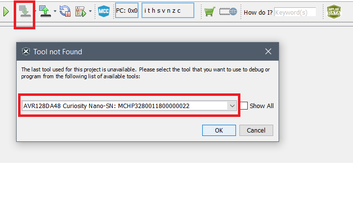

# LED Toggle Using a Button

This repository provides an MPLABX project with an MCC (MPLAB Code Configurator) generated code for a basic application using an LED and a Button. The LED is turned off while the button is pressed and turned on while the button is released.

## Related Documentation
More details and code examples on the AVR128DA48 can be found at the following links:
- [AVR128DA48 Product Page](https://www.microchip.com/wwwproducts/en/AVR128DA28)
- [AVR128DA48 Code Examples on GitHub](https://github.com/microchip-pic-avr-examples?q=avr128da48)
- [AVR128DA48 Project Examples in START](https://start.atmel.com/#examples/AVR128DA48CuriosityNano)

## Software Used
- MPLAB® X IDE 5.40 or newer [(microchip.com/mplab/mplab-x-ide)](http://www.microchip.com/mplab/mplab-x-ide)
- MPLAB® XC8 2.20 or a newer compiler [(microchip.com/mplab/compilers)](http://www.microchip.com/mplab/compilers)
- MPLAB® Code Configurator (MCC) 3.95.0 or newer [(microchip.com/mplab/mplab-code-configurator)](https://www.microchip.com/mplab/mplab-code-configurator)
- MPLAB® Code Configurator (MCC) Device Libraries 8-bit AVR MCUs 2.3.0 or newer [(microchip.com/mplab/mplab-code-configurator)](https://www.microchip.com/mplab/mplab-code-configurator)
- AVR-Dx 1.3.65 or newer Device Pack

## Hardware Used
- AVR128DA48 Curiosity Nano [(DM164151)](https://www.microchip.com/Developmenttools/ProductDetails/DM164151)

## Setup
The AVR128DA48 Curiosity Nano Development Board is used as test platform.
 

The following configurations must be made for this project:

|Pin           | Configuration      |
| :----------: | :----------------: |
|PC6 (LED0)    | Digital Output     |
|PC7 (SW0)     | Digital Input with Pull-up enabled      |

## Operation

1. Open the project from MPLABX IDE

2. Build the project: right click on the *avr128da48-cnano-led-toggle-mcc* project and select *Clean and Build*
 

3. Program *avr128da48-cnano-led-toggle-mcc* project to the board: select *Make and Program Device* and then the corresponding debugger
 

Demo:
 

## Summary
The demo shows a basic LED blink using a button input on the AVR128DA48 Curiosity Nano board. The LED is turned off while the button is pressed and turned on while the button is released. Button debouncing mechanisms are out of the scope for this code example.
